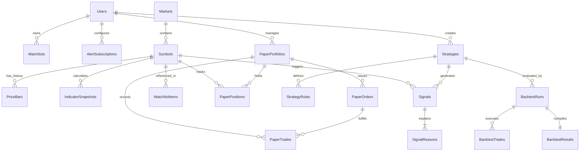

# BIST Quant Scanner – System Architecture & Technical Design

## 1. System Overview

**BIST Quant Scanner** is an enterprise-grade, modular, and extensible quantitative stock analysis, market scanning, algorithmic backtesting, and explainable signal generation platform tailored for Borsa Istanbul (BIST).

### Core Capabilities
* **Automated Universe Scanning**: Continually screens BIST equities across multiple timeframes (Daily, 1 Hour, 15 Minute, etc.) to discover high-probability setups.
* **Deterministic Quantitative Engine**: Calculates core technical indicators (EMA, SMA, RSI, MACD, ATR, ADX, SuperTrend, Bollinger Bands, OBV, Support/Resistance levels) using purely mathematical, reproducible algorithms.
* **Explainable Multi-Factor Scoring**: Evaluates stocks on a 0–100 scale broken down into Trend (40%), Momentum (30%), Volume (15%), and Price Structure (15%). Every score and signal is backed by concrete `SignalReasons`.
* **Signal Classification & Risk Management**: Classifies signals (`STRONG_BUY`, `BUY`, `BUY_CANDIDATE`, `WATCH`, `WEAK`, `SELL`, `STRONG_SELL`) and automatically calculates ATR/Support-based Stop Loss, Take Profit 1 & 2 targets, and Risk/Reward Ratios.
* **Algorithmic Strategy Lab**: Dynamic rule builder allowing combining indicators, comparisons, weights, and criteria without recompilation.
* **Institutional-Grade Backtest Engine**: Backtests strategies with realistic execution assumptions: strict look-ahead bias prevention (next-bar open execution), commission modeling, slippage, trade distribution, equity curve, and drawdown calculation.
* **Virtual Paper Trading**: Complete simulation environment with multi-portfolio tracking, position management, order execution, and optional auto-execution on threshold scores.
* **Multi-Channel Alert Engine**: Real-time notifications via In-App websockets and Telegram Bot with timeframe-based cooldown deduplication.
* **AI Explanation Layer**: Abstracted AI provider (`IAiAnalysisProvider`) delivering narrative summaries and educational explanations of algorithmic findings without hallucinating or making speculative buy/sell decisions.

---

## 2. High-Level System Architecture

```mermaid
graph TB
    subgraph Client Layer
        WebUI[Next.js + TypeScript + Tailwind CSS Frontend]
        TVCharts[TradingView Lightweight Charts]
        TelegramClient[Telegram Messenger App]
    end

    subgraph API Gateway & Presentation
        ReverseProxy[Nginx Reverse Proxy / SSL Termination]
        WebAPI[ASP.NET Core 9/10 Web API]
        Swagger[Swagger / OpenAPI Documentation]
        JwtAuth[JWT Authentication & Refresh Tokens]
        HealthCheck[/health Health Checks]
    end

    subgraph Core Application & Engines
        ScannerSvc[MarketScannerService]
        IndicatorEng[Technical Indicator Engine]
        ScoreEng[Stock Scoring Engine]
        SignalEng[Signal & Risk Engine]
        StrategyEng[Strategy Execution Engine]
        BacktestEng[Backtest Simulation Engine]
        PaperTrading[Paper Trading Engine]
        AiExplainer[AI Narrative Explainer]
    end

    subgraph Background Processing
        Worker[BistQuant.Worker / Hangfire Scheduler]
        ScannerJob[Market Scanner Recurring Jobs]
        AlertJob[Alert & Notification Dispatcher]
    end

    subgraph Persistence & Caching
        MSSQL[(Microsoft SQL Server 2025/2022)]
        RedisCache[(Redis Cache / Distributed Memory)]
    end

    subgraph External Interfaces
        MarketDataProv[IMarketDataProvider]
        MockProv[Mock / Seed Data Provider]
        CsvProv[CSV Market Data Importer]
        LiveApiProv[Licensed BIST API Provider]
        TelegramProv[Telegram Bot Notification Provider]
        OpenAiProv[OpenAI / Ollama AI Provider]
    end

    WebUI --> ReverseProxy
    ReverseProxy --> WebAPI
    WebAPI --> Core Application & Engines
    Worker --> Core Application & Engines
    Worker --> AlertJob
    AlertJob --> TelegramProv --> TelegramClient
    
    Core Application & Engines --> MSSQL
    Core Application & Engines --> RedisCache
    Core Application & Engines --> MarketDataProv

    MarketDataProv --> MockProv
    MarketDataProv --> CsvProv
    MarketDataProv --> LiveApiProv
```

---

## 3. Technology Stack & Frameworks

| Component | Technology | Version / Specification | Rationale |
| :--- | :--- | :--- | :--- |
| **Runtime & SDK** | .NET | 10.0 / 9.0 LTS | High performance, memory efficiency, native async/await |
| **Web Framework** | ASP.NET Core Web API | 9.0/10.0 | Enterprise-grade REST endpoints, dependency injection |
| **ORM & Persistence** | Entity Framework Core | 9.0/10.0 with SqlServer provider | Code-First migrations, optimized compiled queries, bulk inserts |
| **Database** | Microsoft SQL Server | 2022/2025 Linux Native / Container | Native relational integrity, composite indices, temporal tables |
| **Distributed Caching** | Redis + MemoryCache Fallback | Redis 7+ / StackExchange.Redis | Sub-millisecond read access for scanner results and snapshots |
| **Task Scheduling** | Hangfire / BackgroundService | Hangfire 1.8+ / IHostedService | Scheduled scanner jobs (15m, 1h, Daily), retry logic, dashboard |
| **Validation** | FluentValidation | 11.x | Clean, decoupled domain model validation |
| **Logging** | Serilog | 4.x (Console, File, MSSQL Sinks) | Structured JSON logging, contextual diagnostic tracing |
| **Frontend Framework** | Next.js / React | Next.js 15, React 19, TypeScript | Server Components, responsive routing, fast rendering |
| **Styling & UI** | Tailwind CSS + Lucide Icons | Dark Financial Terminal Theme | Minimalistic, responsive, high-density data visualization |
| **Financial Charting** | TradingView Lightweight Charts | 4.x / Canvas-based | Highest performance candlestick rendering, crosshair, overlay |
| **Containerization** | Docker & Docker Compose | Multi-stage build | Reproducible environments, isolated worker/API/frontend |

---

## 4. Clean Architecture & Solution Organization

The solution strictly adheres to Clean Architecture and SOLID design principles. Dependencies point inward:

```text
/home/test/Desktop/Finance/
├── BistQuant.sln
├── docker-compose.yml
├── docker-compose.prod.yml
├── .env.example
├── architecture.md
├── implementation.md
├── tasks.md
│
├── src/
│   ├── BistQuant.Domain/
│   │   ├── Common/
│   │   │   ├── BaseEntity.cs
│   │   │   ├── IAggregateRoot.cs
│   │   │   └── ValueObject.cs
│   │   ├── Entities/
│   │   │   ├── Market.cs
│   │   │   ├── Symbol.cs
│   │   │   ├── PriceBar.cs
│   │   │   ├── IndicatorSnapshot.cs
│   │   │   ├── Signal.cs
│   │   │   ├── SignalReason.cs
│   │   │   ├── Strategy.cs
│   │   │   ├── StrategyRule.cs
│   │   │   ├── BacktestRun.cs
│   │   │   ├── BacktestTrade.cs
│   │   │   ├── BacktestResult.cs
│   │   │   ├── PaperPortfolio.cs
│   │   │   ├── PaperPosition.cs
│   │   │   ├── PaperOrder.cs
│   │   │   ├── PaperTrade.cs
│   │   │   ├── Watchlist.cs
│   │   │   ├── WatchlistItem.cs
│   │   │   ├── AlertSubscription.cs
│   │   │   ├── AlertNotification.cs
│   │   │   └── User.cs
│   │   ├── Enums/
│   │   │   ├── Timeframe.cs (M1, M5, M15, M30, H1, H4, Daily, Weekly)
│   │   │   ├── SignalType.cs (StrongSell, Sell, Weak, Watch, BuyCandidate, Buy, StrongBuy)
│   │   │   ├── RuleOperator.cs (GreaterThan, LessThan, CrossAbove, CrossBelow, Equal)
│   │   │   ├── OrderType.cs (Market, Limit, StopLoss)
│   │   │   ├── OrderSide.cs (Buy, Sell)
│   │   │   ├── OrderStatus.cs (Pending, Filled, Cancelled, Rejected)
│   │   │   ├── NotificationChannel.cs (InApp, Telegram, Email, WebPush)
│   │   │   └── BacktestStatus.cs (Pending, Running, Completed, Failed)
│   │   └── Models/
│   │       ├── TechnicalScores.cs
│   │       ├── RiskParameters.cs
│   │       └── IndicatorCalculationResult.cs
│   │
│   ├── BistQuant.Application/
│   │   ├── Common/
│   │   │   ├── Interfaces/
│   │   │   │   ├── IApplicationDbContext.cs
│   │   │   │   ├── ICacheService.cs
│   │   │   │   ├── ICurrentUserService.cs
│   │   │   │   └── IDateTimeProvider.cs
│   │   │   ├── Models/
│   │   │   │   ├── PagedResult.cs
│   │   │   │   ├── ApiResponse.cs
│   │   │   │   └── ErrorDetail.cs
│   │   │   └── Exceptions/
│   │   ├── DTOs/
│   │   │   ├── MarketData/ (PriceBarDto, SymbolDto, HistoricalBarsRequest)
│   │   │   ├── Indicators/ (IndicatorSnapshotDto, IndicatorValuesDto)
│   │   │   ├── Signals/ (SignalDto, SignalReasonDto, SignalFilterDto)
│   │   │   ├── Scanner/ (ScannerResultDto, ScannerFilterDto)
│   │   │   ├── Strategies/ (StrategyDto, StrategyRuleDto, CreateStrategyRequest)
│   │   │   ├── Backtests/ (BacktestRunRequest, BacktestResultDto, TradeDto)
│   │   │   ├── PaperTrading/ (PortfolioDto, PositionDto, CreateOrderRequest)
│   │   │   ├── Alerts/ (AlertSubscriptionDto, CreateAlertRequest)
│   │   │   └── Auth/ (LoginRequest, RegisterRequest, AuthResponse)
│   │   ├── Interfaces/
│   │   │   ├── IMarketDataProvider.cs
│   │   │   ├── ITechnicalAnalysisService.cs
│   │   │   ├── IScoringEngine.cs
│   │   │   ├── ISignalEngine.cs
│   │   │   ├── IStrategyEngine.cs
│   │   │   ├── IMarketScannerService.cs
│   │   │   ├── IBacktestEngine.cs
│   │   │   ├── IPaperTradingService.cs
│   │   │   ├── IAlertEngine.cs
│   │   │   ├── INotificationProvider.cs
│   │   │   └── IAiAnalysisProvider.cs
│   │   └── Services/
│   │       ├── TechnicalAnalysisService.cs
│   │       ├── ScoringEngine.cs
│   │       ├── SignalEngine.cs
│   │       ├── StrategyEngine.cs
│   │       ├── MarketScannerService.cs
│   │       ├── BacktestEngine.cs
│   │       ├── PaperTradingService.cs
│   │       └── AlertEngine.cs
│   │
│   ├── BistQuant.Infrastructure/
│   │   ├── Persistence/
│   │   │   ├── BistQuantDbContext.cs
│   │   │   ├── Configurations/ (EntityTypeConfigurations with Fluent API)
│   │   │   ├── Seed/ (BistSymbolsSeed, HistoricalDataSeeder)
│   │   │   └── Migrations/
│   │   ├── Caching/
│   │   │   └── RedisCacheService.cs (with MemoryCache fallback)
│   │   ├── Providers/
│   │   │   ├── MarketData/
│   │   │   │   ├── MockMarketDataProvider.cs
│   │   │   │   ├── CsvMarketDataProvider.cs
│   │   │   │   └── YahooBistMarketDataProvider.cs
│   │   │   ├── Notifications/
│   │   │   │   ├── TelegramNotificationProvider.cs
│   │   │   │   └── InAppNotificationProvider.cs
│   │   │   └── Ai/
│   │   │       ├── MockAiAnalysisProvider.cs
│   │   │       └── OpenAiAnalysisProvider.cs
│   │   └── Background/
│   │       ├── HangfireConfiguration.cs
│   │       └── ScannerBackgroundJob.cs
│   │
│   ├── BistQuant.API/
│   │   ├── Controllers/
│   │   │   ├── AuthController.cs
│   │   │   ├── SymbolsController.cs
│   │   │   ├── MarketDataController.cs
│   │   │   ├── AnalysisController.cs
│   │   │   ├── ScannerController.cs
│   │   │   ├── StrategiesController.cs
│   │   │   ├── BacktestController.cs
│   │   │   ├── PaperTradingController.cs
│   │   │   ├── WatchlistsController.cs
│   │   │   ├── AlertsController.cs
│   │   │   ├── AiAnalysisController.cs
│   │   │   └── AdminController.cs
│   │   ├── Middleware/
│   │   │   ├── GlobalExceptionHandlingMiddleware.cs
│   │   │   └── RateLimitingMiddleware.cs
│   │   ├── Extensions/
│   │   │   └── ServiceCollectionExtensions.cs
│   │   ├── appsettings.json
│   │   ├── appsettings.Development.json
│   │   └── Program.cs
│   │
│   └── BistQuant.Worker/
│       ├── Program.cs
│       ├── WorkerService.cs
│       └── appsettings.json
│
├── frontend/
│   ├── src/
│   │   ├── app/
│   │   │   ├── layout.tsx
│   │   │   ├── page.tsx (Landing / Overview)
│   │   │   ├── dashboard/page.tsx (Market Dashboard)
│   │   │   ├── scanner/page.tsx (BIST Screener & Filter)
│   │   │   ├── stocks/[symbol]/page.tsx (Interactive Chart & Technical Detail)
│   │   │   ├── strategies/page.tsx (Strategy Lab)
│   │   │   ├── backtests/page.tsx (Backtest Execution & Metrics)
│   │   │   ├── backtests/[id]/page.tsx (Backtest Run Detail)
│   │   │   ├── paper-trading/page.tsx (Virtual Portfolio & Orders)
│   │   │   ├── watchlists/page.tsx (Custom Watchlists)
│   │   │   ├── alerts/page.tsx (Alert Rules & History)
│   │   │   ├── settings/page.tsx (Configuration & API Keys)
│   │   │   └── login/page.tsx
│   │   ├── components/
│   │   │   ├── layout/ (Sidebar, TopNav, MarketStatusBanner)
│   │   │   ├── charts/ (CandlestickChart, MiniSparkline, EquityCurveChart)
│   │   │   ├── ui/ (Button, Card, Badge, Modal, Input, Tabs, Table)
│   │   │   ├── scanner/ (FilterBar, ScannerTable, ScoreBadge, SignalPill)
│   │   │   └── stock/ (AnalysisSummaryCard, SignalReasonsCard, RiskRewardCard)
│   │   ├── hooks/ (useScanner, useMarketData, useStockAnalysis, useBacktest)
│   │   ├── lib/ (apiClient, formatters, chartHelpers)
│   │   └── types/ (api contracts, stock types, signal types)
│   ├── tailwind.config.ts
│   ├── tsconfig.json
│   └── package.json
│
└── tests/
    ├── BistQuant.Domain.Tests/
    │   ├── ScoringEngineTests.cs
    │   └── SignalClassificationTests.cs
    ├── BistQuant.Application.Tests/
    │   ├── IndicatorCalculationTests.cs
    │   ├── StrategyEngineTests.cs
    │   └── BacktestEngineTests.cs
    └── BistQuant.IntegrationTests/
        └── ApiEndpointTests.cs
```

---

## 5. Database Architecture & Schema Design

MSSQL is the primary relational store. The schema is optimized with composite indices on frequently queried time-series data to guarantee sub-50ms query latency.



### Table Definitions & Indexing Strategy

1. **`Markets`**:
   - `Id` (INT, PK), `Code` (VARCHAR(10), UNIQUE, e.g. "BIST"), `Name` (NVARCHAR(100)), `Country` (VARCHAR(50)), `Currency` (VARCHAR(10)), `Timezone` (VARCHAR(50), e.g. "Europe/Istanbul").
2. **`Symbols`**:
   - `Id` (INT, PK), `MarketId` (INT, FK), `Ticker` (VARCHAR(20), UNIQUE, e.g. "THYAO"), `Name` (NVARCHAR(200)), `Sector` (NVARCHAR(100)), `Industry` (NVARCHAR(100)), `IsActive` (BIT), `CreatedAt` (DATETIME2), `UpdatedAt` (DATETIME2).
   - Index: `IX_Symbols_Ticker`, `IX_Symbols_Sector_IsActive`.
3. **`PriceBars`**:
   - `Id` (BIGINT, PK), `SymbolId` (INT, FK), `Timeframe` (TINYINT), `Timestamp` (DATETIME2), `Open` (DECIMAL(18,4)), `High` (DECIMAL(18,4)), `Low` (DECIMAL(18,4)), `Close` (DECIMAL(18,4)), `Volume` (DECIMAL(24,2)), `AdjustedClose` (DECIMAL(18,4)), `CreatedAt` (DATETIME2).
   - Unique Composite Index: `UIX_PriceBars_Symbol_Timeframe_Timestamp (SymbolId, Timeframe, Timestamp DESC)` include `(Open, High, Low, Close, Volume)`.
4. **`IndicatorSnapshots`**:
   - `Id` (BIGINT, PK), `SymbolId` (INT, FK), `Timeframe` (TINYINT), `Timestamp` (DATETIME2), `RSI14`, `EMA20`, `EMA50`, `EMA100`, `EMA200`, `SMA20`, `SMA50`, `SMA200`, `MACD`, `MACDSignal`, `MACDHistogram`, `ATR14`, `ADX14`, `SuperTrend`, `SuperTrendDirection` (TINYINT), `BollingerUpper`, `BollingerMiddle`, `BollingerLower`, `VWAP`, `OBV`, `StochasticK`, `StochasticD`, `ROC`, `AverageVolume20`, `CreatedAt` (DATETIME2).
   - Unique Composite Index: `UIX_IndicatorSnapshots_Symbol_Timeframe_Timestamp (SymbolId, Timeframe, Timestamp DESC)`.
5. **`Signals`**:
   - `Id` (BIGINT, PK), `SymbolId` (INT, FK), `StrategyId` (INT, FK, NULLABLE), `Timeframe` (TINYINT), `SignalType` (TINYINT), `Score` (INT), `TrendScore` (INT), `MomentumScore` (INT), `VolumeScore` (INT), `StructureScore` (INT), `Price` (DECIMAL(18,4)), `StopLoss` (DECIMAL(18,4)), `TakeProfit1` (DECIMAL(18,4)), `TakeProfit2` (DECIMAL(18,4)), `RiskRewardRatio` (DECIMAL(10,2)), `Confidence` (DECIMAL(5,2)), `CreatedAt` (DATETIME2), `ExpiresAt` (DATETIME2).
   - Index: `IX_Signals_Timeframe_CreatedAt_Score (Timeframe, CreatedAt DESC, Score DESC)`.
6. **`SignalReasons`**:
   - `Id` (BIGINT, PK), `SignalId` (BIGINT, FK), `Code` (VARCHAR(50)), `Title` (NVARCHAR(100)), `Description` (NVARCHAR(500)), `ScoreContribution` (INT), `Indicator` (VARCHAR(50)), `IndicatorValue` (DECIMAL(18,4)), `CreatedAt` (DATETIME2).
7. **`Strategies` & `StrategyRules`**:
   - Dynamic user or system predefined strategies. Rules store indicator name, operator (`>`, `<`, `CrossAbove`, etc.), value/comparison indicator, weight, and logical groups.
8. **`BacktestRuns`, `BacktestTrades`, `BacktestResults`**:
   - Detailed execution tracking with PnL, exit reasons, Sharpe, Sortino, Drawdown, Profit Factor.
9. **`PaperPortfolios`, `PaperPositions`, `PaperOrders`, `PaperTrades`**:
   - Simulated portfolio state, order queues, execution fills, unrealized and realized PnL.
10. **`AlertSubscriptions` & `AlertNotifications`**:
    - User alerts, condition triggers, deduplication cooldown logs.

---

## 6. Data Flow & Processing Pipeline

The system is architected around an explicit unidirectional pipeline that decouples data retrieval, mathematical calculations, scoring, and downstream distribution:

```
[Market Data Provider]
       │ (Raw OHLCV Bars)
       ▼
[Data Validation & Ingestion]
       │ (Validated PriceBars)
       ▼
[Indicator Engine] (Pure math functions: EMA, RSI, SuperTrend, etc.)
       │ (IndicatorSnapshot)
       ▼
[Strategy & Rule Engine] (Evaluates dynamic & predefined strategy rules)
       │ (Rule Evaluation Context)
       ▼
[Multi-Factor Scoring Engine] (Computes 0-100 score + sub-scores)
       │ (Scores & Signal Reasons)
       ▼
[Signal & Risk Engine] (Classifies SignalType, StopLoss, TP1, TP2, R:R)
       │ (Persisted Signal & Reasons)
       ├───► [Redis Cache] (Fast UI Scanner & Dashboard reads)
       ├───► [Alert Engine] (Evaluates subscriptions & dispatches Telegram/In-App)
       └───► [Paper Trading Auto-Strategy] (Simulates execution if configured)
```

---

## 7. Mathematical Specifications for Technical Indicators

All calculations are implemented deterministically without external black-box libraries:

1. **Exponential Moving Average (EMA)**:
   $$\alpha = \frac{2}{N + 1}, \quad EMA_t = \text{Price}_t \times \alpha + EMA_{t-1} \times (1 - \alpha)$$
2. **Relative Strength Index (RSI 14)** (Wilder's Smoothing):
   $$RS = \frac{\text{Smoothed Gain}}{\text{Smoothed Loss}}, \quad RSI = 100 - \frac{100}{1 + RS}$$
3. **Moving Average Convergence Divergence (MACD)**:
   $$\text{MACD Line} = EMA_{12} - EMA_{26}, \quad \text{Signal Line} = EMA_9(\text{MACD Line}), \quad \text{Histogram} = \text{MACD} - \text{Signal}$$
4. **Average True Range (ATR 14)**:
   $$TR = \max(High - Low, |High - Close_{prev}|, |Low - Close_{prev}|), \quad ATR_t = \frac{ATR_{t-1} \times 13 + TR_t}{14}$$
5. **Average Directional Index (ADX 14)**:
   Directional Movement $+DM$ and $-DM$, smoothed over 14 periods, $DX = \frac{|+DI - -DI|}{+DI + -DI} \times 100$, $ADX = \text{WilderSmoothed}(DX, 14)$.
6. **SuperTrend (ATR Multiplier $M=3.0$, Period=10)**:
   $$\text{Basic Upper} = \frac{High + Low}{2} + M \times ATR, \quad \text{Basic Lower} = \frac{High + Low}{2} - M \times ATR$$
   Tracks trailing stop bands and flips trend direction on bar close penetration.
7. **Support / Resistance & Breakouts**:
   Local extrema detection (Rolling $N$-bar swing highs and swing lows with ATR clustering). Breakout confirmed when $Close > \text{Resistance}$ with Volume ratio $> 1.25$.

---

## 8. Quantitative Scoring & Signal Classification

### Score Breakdown (Max 100 Points)

| Category | Max Pts | Sample Rule / Metric | Contribution |
| :--- | :---: | :--- | :---: |
| **Trend** | **40** | $Close > EMA20$ | +5 |
| | | $EMA20 > EMA50$ | +10 |
| | | $EMA50 > EMA200$ (Golden Stack) | +10 |
| | | SuperTrend Direction == BUY | +10 |
| | | $ADX > 20$ (Trending Market) | +5 |
| **Momentum** | **30** | $RSI \in [50, 65]$ (Healthy Bullish Momentum) | +10 |
| | | $MACD > MACDSignal$ | +10 |
| | | Fresh MACD Bullish Crossover (within 3 bars) | +5 |
| | | Stochastic %K > %D & %K < 80 | +5 |
| **Volume** | **15** | $Volume > AverageVolume20 \times 1.2$ | +5 |
| | | $Volume > AverageVolume20 \times 1.5$ | +5 |
| | | On-Balance Volume (OBV) Rising ($OBV > OBV_{prev5}$) | +5 |
| **Price Structure** | **15** | 20-Day Resistance Breakout | +5 |
| | | Higher High ($HH$) Formation | +5 |
| | | Higher Low ($HL$) Formation | +5 |

### Signal Tiers
* **85 – 100**: `STRONG_BUY`
* **75 – 84**: `BUY`
* **65 – 74**: `BUY_CANDIDATE`
* **50 – 64**: `WATCH`
* **35 – 49**: `WEAK`
* **20 – 34**: `SELL`
* **0 – 19**: `STRONG_SELL`

### Automated Risk Levels
* **Entry**: Current Bar Close price.
* **Stop Loss**: $\max(Entry - (ATR_{14} \times 2.0), \text{Immediate Support Level})$.
* **Take Profit 1**: $Entry + (Entry - StopLoss) \times 1.5$ (or nearest Resistance 1).
* **Take Profit 2**: $Entry + (Entry - StopLoss) \times 2.5$ (or nearest Resistance 2).
* **Risk / Reward**: $\frac{TP1 - Entry}{Entry - StopLoss}$.

---

## 9. Backtest Engine Architecture

To eliminate historical simulation fallacies, the Backtest Engine strictly enforces:
1. **Look-Ahead Bias Elimination**: Signals triggered on candle $T$ (using data available up to $T.Close$) are strictly executed at the **Open** of candle $T+1$.
2. **Realistic Friction Modeling**:
   - Commission rate (default 0.15% per trade for BIST).
   - Slippage rate (default 0.10% price slippage).
3. **Bar-by-Bar High/Low Evaluation**: Intraday Stop Loss and Take Profit levels are checked against $High_{t+1}$ and $Low_{t+1}$. If both are breached in the same bar, conservative assumption triggers Stop Loss first.
4. **Comprehensive Statistical Output**:
   - Total Return (%), Win Rate (%), Total Trades.
   - Profit Factor ($\frac{\text{Gross Profits}}{\text{Gross Losses}}$), Max Drawdown (%), Max Drawdown Duration.
   - Sharpe Ratio (annualized), Sortino Ratio (downside risk only), Expectancy per trade.
   - Equity curve time-series and monthly return heatmap.

---

## 10. Security, Caching & Performance Architecture

1. **Authentication & Authorization**:
   - ASP.NET Core Identity with JWT Bearer authentication.
   - Refresh Token pattern with secure HttpOnly cookies / bearer headers.
   - Role-based authorization (`Admin`, `User`).
2. **Rate Limiting**:
   - Token bucket algorithm per IP / User for high-compute endpoints (Scanner, Backtest, AI analysis).
3. **Caching Strategy**:
   - Tier 1: In-memory cache (`IMemoryCache`) for symbol metadata and active configuration.
   - Tier 2: Distributed Redis Cache for latest scanner results, top signals, and indicator snapshots. Timeframe-dependent TTL (15m data: 5 min TTL; Daily data: 1 hr TTL).
   - Fallback: Graceful degradation to In-Memory cache if Redis is unavailable.
4. **Database Performance**:
   - `AsNoTracking()` for all read queries.
   - Bulk copy / batch insert for historical OHLCV data.
   - Server-side pagination and indexed filtering for scanner queries.

---

## 11. Deployment Architecture (Docker & Nginx)

```text
[Internet / HTTPS 443]
       │
       ▼
[Nginx Reverse Proxy]
       ├───► /api/*       ───► [bistquant-api:5000]
       ├───► /hangfire/*  ───► [bistquant-api:5000]
       ├───► /health      ───► [bistquant-api:5000/health]
       └───► /*           ───► [bistquant-frontend:3000]

Internal Network (bistquant-net):
       ├── [bistquant-api]
       ├── [bistquant-worker]
       ├── [bistquant-mssql:1433]
       └── [bistquant-redis:6379]
```
All containers communicate through an isolated Docker bridge network. Configuration parameters and sensitive credentials are provided strictly via environment variables.
